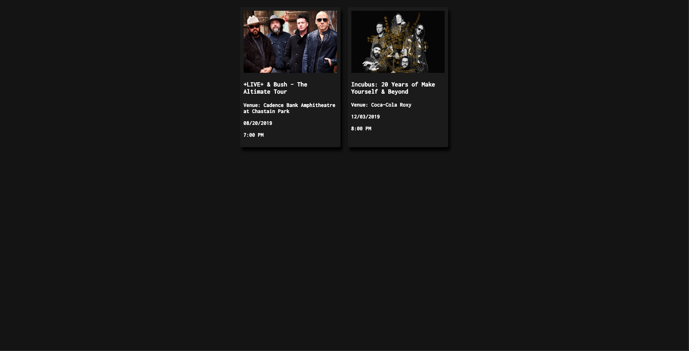

# ShowHunter

## Description

ShowHunter is a web application that takes a band name as user input and provides the user with a series of nearby concerts for related artists. In its current state, ShowHunter only searches for events in the Atlanta GA area. 

---

## How It Works

A user will click on the magnifying glass at the center of the page and enter a band name into the search area. The site will automatically scroll to the bottom of the page where a loading icon can be seen. ShowHunter will first search through the Spotify API to find the band's unique Spotify ID. Using this ID, it will then search for the band's related artists also in the Spotify API. This will return an array of 20 related artists along with all of their info. ShowHunter then places only the artist names in a separate array.

With this array of related artists, ShowHunter then searches the Ticketmaster API for events in the Atlanta area for all of the bands in the array. It will then create event cards to populate into the DOM. When the first event is populated, the loading icon disappears. The site is scaleable for all device sizes and event cards will stack above one another when the screen is sufficiently small. 

Event cards include an image of the band/venue, the band name, the venue name, the date, and the time of the show.

---

## Behind the Scenes

Spotify API requires a server to access. In order to bypass this issue (as this was intended as a front-end only project) all Spotify requests are done using a remote proxy server. In addition to this, oauth authentification is necessary. As of right now, oauth tokens are manually entered into the code as they expire. A feature will be added to automatically handle this.

---

## Screenshots

Show Hunter homepage

Sample search

Loading icon

Sample results

